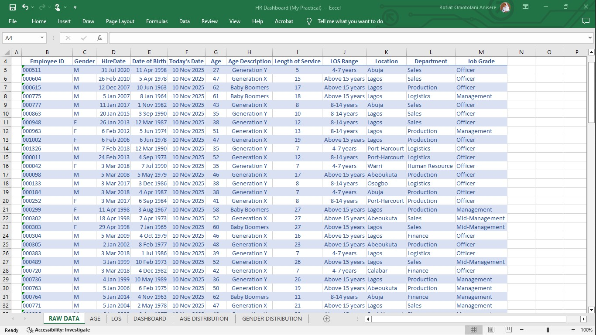
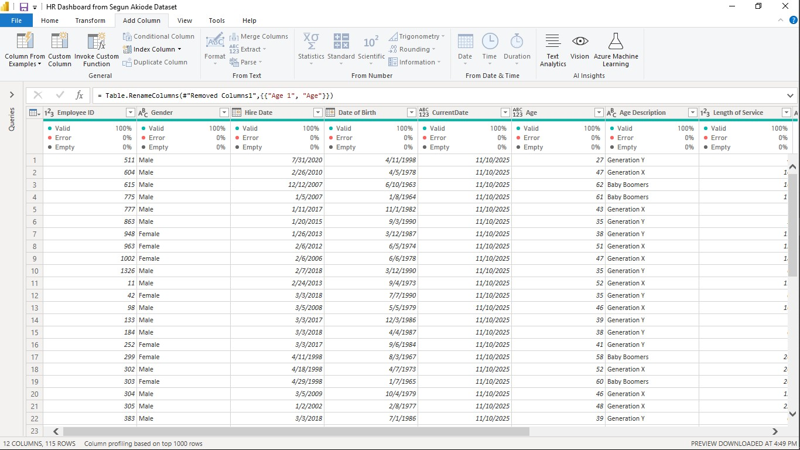
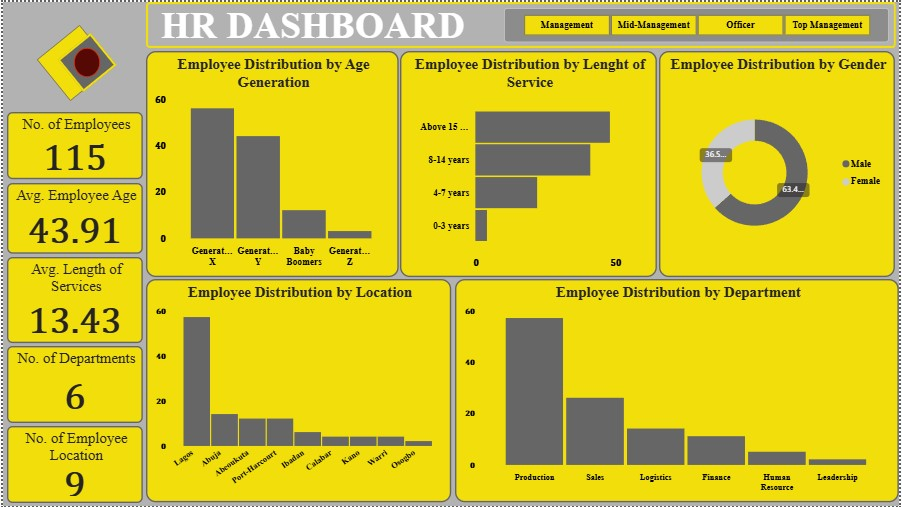

# Human-Resources-Analyzed-Data
[HR Analysis]

## Introduction
The project is based on understanding employee demographic information from a production company. Through an interactive dashboard, we can gain insight primarily into the workforce distribution of the company.

###Disclaimer:
##### The dataset was obtained from a Human Resources Analyst's YouTube channel and it is only for learning purposes.

## Problem Statement
The main aim of the dataset is to have a better understanding of the demographic distribution of the workforce. The dataset provided answers to the following questions;

- What is the gender difference in our workforce?
- What is the age distribution of employees across different age generations?
- What is the departmental distribution of our workforce?
- What is the average length of service of our workforce?

# Skills and Expertise
- Understanding the Dataset: Having an understanding of a dataset is crucial in data analysis. It helps gain an understanding of what questions our data can provide answers to and what problems we can solve using the data.
  
- Data Cleaning and Transformation: The dataset was obtained semi-cleaned. The use of Excel and Power Query Editor to handle incomplete columns, create new columns from existing columns, delete duplicates, and correct inconsistencies in data.
  
- Data Analysis: With the use of Power BI to provide insight into our problem statement, identify key points, trends, and patterns.
  
- Data Visualization: Using appropriate cards and charts to visualize the analysis for clear and structured insight into findings.
  
- Observation: The understanding of the findings, visuals, and charts to evaluate the key indicators of the workforce.
  
- Insight: A synthesis of the findings, explanation, and self-thought and perception of the findings.
  
#### The skills and expertise ensured a thorough analysis was obtained to provide adequate insight into the demographic distribution of the organization's workforce.

# Challenges
A major challenge encountered in ensuring the dataset is consistently up-to-date on the functions used.

##### the challenge is described below.

#### The dataset was gotten like I mentioned above from a YouTube channel and it was analyzed using Excel several months ago. Later on, it was analyzed again using Power BI. A few discoveries were made when the age column was incorrect and inconsistent with the current year.

##### What are the discoveries?
- The data table in Excel is updated because the age was calculated using the Today() function and the date of birth. Whereas, no update was found on Power BI.
  
- Power Bl treated the Excel Function output as a number and not as a formula-generated digit.
  
Therefore, the findings are inaccurate because the Power BI dashboard does not reflect the updated employees’ ages. There is also an inconsistency in the Excel data and the Power BI data.

##### What was done?
- Another column was created for the current date in Power Query Editor directly on Power BI.

- Another age column was created using a Power BI formula with the use of the employee's date of birth and the current age to reflect the updated employee's age.
  
- The initial age column was deleted which affected the calculated measure for 'Average Employee's Age’.

- The new age column is saved by Power BI as a text and it was manually changed to a whole number before it reflects the correct calculated measure for the average employee’s age. 

##### What was achieved?
Through the above challenge, 

- An employee’s age column was created that will be up-to-date and automatically reflect the increase in age of the employees. 

- The new update altered the initial findings

# Data Modelling
| Data in Excel | Data in Power |
|---------------|---------------|
| | |

| Dashboard |
|-----------|
| |

# Key Insight
- A total of 115 employees showed a mid-sized organization.

- The average employee's age is 43.91 which shows a mature workforce.

-Generation X dominated the workforce, followed by Generation Y, with minimal representation of Baby Boomers and Generation Z.

- There is a gender imbalance in the workforce with 63.4% males and 36.5% females. 

- The average length of service of an employee is 13 years, which provides insight into the retention strategy.

- The production department dominates the workforce followed by Sales, while other departments have significantly lower representation. 

# Recommendations
- With a mature workforce, there is a high possibility of retirement in the coming years. Active recruitment of the younger generation and talent
        - To prevent knowledge loss
        - Bring in new perspectives and ideas
        - Encourage Innovation

- Upskilling: With an aging workforce, there is a need to upskill in new and updated knowledge, close skill gaps in technologies, and digital skills.

- Gender Imbalance: Address the gender inconsistency during recruitment to foster inclusion. 

# Final Thought & Conclusion
It can be said that the dataset is incomplete, further analysis should be conducted to extend beyond the demographic of the workforce. Data such as the employees’ satisfaction, performance, engagement, promotion, and further breakdown of manpower distribution in the production department in relation to the output result will provide more insight into how the workforce affects the business development of the organization.

